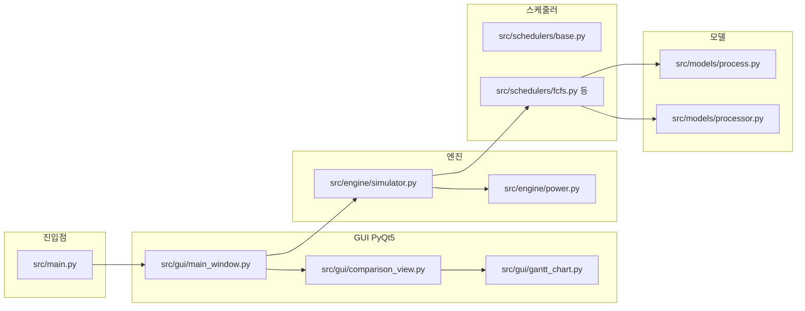

# 프로세스 스케줄링 시뮬레이터 — 구조 파악 및 코드 리뷰

## 후속 작업 (체크리스트)

- [ ] FCFS `queue_snapshots` 내부 불필요한 `if arrived_at not in queue_snapshots` 분기 제거(선택)
- [ ] `test_process_reset`에 `service_time` 리셋 및 `service_time` 기준 NTT 단언 테스트 추가(권장)
- [ ] `pytest` 전체 실행으로 회귀 확인
- [ ] [선택] `thanos.py` 미사용 `import math` 제거
- [ ] [선택] `srtn.py` 미사용 `import math` 제거
- [ ] [선택/설계] 동일 시각 `queue_snapshots` 키 덮어쓰기(멀티코어) — 리스트/복합 키 등으로 보강 여부 검토

## 프로젝트 구조

- **역할**: [`src/models/process.py`](../src/models/process.py) 프로세스(AT/BT/메트릭), [`src/models/processor.py`](../src/models/processor.py) 코어별 `work_per_tick`(P=2, E=1) 및 전력.
- **스케줄러**: [`src/schedulers/base.py`](../src/schedulers/base.py)의 `ScheduleResult`(타임라인, `queue_snapshots`, 전력) 구현체들이 공유.
- **실행·리포트**: [`src/engine/simulator.py`](../src/engine/simulator.py)가 스케줄 후 `processes` 메트릭과 평균값을 dict로 묶어 GUI/테스트가 소비.
- **검증**: [`tests/`](../tests/)에 알고리즘별·멀티코어·Thanos 등 단위 테스트.

---

## 워킹 트리 변경(diff) 요지 — 리뷰 관점에서 “맞는 방향”

1. **`service_time` 도입** ([`process.py`](../src/models/process.py))
   - 비선점형(FCFS/SPN/HRRN): `exec_ticks = ceil(burst / work_per_tick)`와 동일하게 **시뮬레이션 tick 단위 점유 시간**으로 두는 것이 P 코어 모델과 일치합니다.
   - 선점형(RR/SRTN/Thanos): 매 tick `service_time += 1`은 “흐른 시각 1칸당 코어 점유 1회”와 동일해, `waiting_time = TT - service_time`가 일관됩니다.

2. **NTT**
   - `st = service_time if service_time > 0 else burst_time` 폴백은 단일 E 코어 등에서 기존 정의와 호환되고, P 코어에서는 “실제 점유 tick” 기준으로 정규화되어 의미가 맞습니다.

3. **`queue_snapshots` 보강** (FCFS/SPN/HRRN)
   - 실행 구간 `(start, end]` 안에서 도착하는 프로세스에 대해 도찀 시각 키로 스냅샷을 남기는 것은 UI/교육 목적에 타당합니다.

4. **GUI** ([`comparison_view.py`](../src/gui/comparison_view.py))
   - `process_ids`를 `num_rows` 계산 전에 두도록 한 것은 **실제 버그 수정**(이전에는 정의 전 참조 가능)으로 적절합니다.

---

## 개선·주의 제안 (리뷰 코멘트)

| 구분 | 내용 |
|------|------|
| **사소한 정리** | [`fcfs.py`](../src/schedulers/fcfs.py) 53–54행 `if arrived_at not in queue_snapshots: queue_snapshots[arrived_at] = []`는 바로 다음 줄에서 항상 `waiting_at`으로 덮어쓰므로 **불필요**합니다. 동작에는 영향 없음. |
| **테스트 보강(권장)** | [`tests/test_process.py`](../tests/test_process.py)의 `test_process_reset`에 `service_time` 리셋 검증 추가가 자연스럽습니다. `service_time > 0`인 경우 NTT가 `burst`가 아닌 `service_time`으로 나가는 **명시적 케이스** 하나가 있으면 회귀 방지에 좋습니다. |
| **API 일관성(선택)** | [`simulator.py`](../src/engine/simulator.py)의 `process_details`에 `service_time` 필드를 넣지 않아, GUI/외부 소비자는 지금도 pid/at/bt/ct/wt/tt/ntt만 봅니다. 내부 디버깅·표시가 필요하면 추가 검토 가치만 있음. |
| **타입 힌트(기존)** | `ScheduleResult.queue_snapshots: dict`는 `dict[int, list[str]]` 등으로 좁히면 이후 유지보수에 도움됨(이번 변경 범위 밖으로 두어도 됨). |

---

## 검증 권장

메트릭 변경이 있으므로 로컬에서 `pytest` 전체 실행으로 회귀 여부를 확인하는 것이 안전합니다.

---

## 상세 리뷰 (전 코드베이스, 정밀)

### 1. 진입점·구성 ([`src/main.py`](../src/main.py))

- QApplication + 다크 테마 + `MainWindow`만 연결하는 **얇은 진입점**으로 적절함. `sys.path` 조작 없이 `gui` import — 실행 시 `cwd`가 `src` 상위일 때 [`README`](../README.md) 실행 방식과 일치해야 함(일반적으로 `python -m` 또는 `PYTHONPATH`).

### 2. 프로세스·프로세서 모델

- [`process.py`](../src/models/process.py): `remaining_time`은 `__post_init__`에서 BT로 초기화. `service_time` 추가 후 `reset()`까지 초기화하는 것은 일관됨. **엣지**: `burst_time == 0`이면 `ntt`는 0.0 — 데이터는 GUI에서 BT≥1로 막지만, 라이브러리로 쓸 때는 방어 없음.
- [`processor.py`](../src/models/processor.py): P/E 스펙이 상수로 고정. `tick()`의 시동 전력은 **프로세스 할당 직후 첫 바쁜 tick**에 합산 — 선점형 스케줄러 루프와 의미상 맞음.

### 3. 스케줄러별 동작·정합성

- **FCFS** ([`fcfs.py`](../src/schedulers/fcfs.py)): 도착 순 정렬 + “가장 빨리 비는 코어” 배치는 멀티코어 FCFS의 합리적 변형. `exec_ticks`/`service_time`/`WT=TT−service_time` 일치. `queue_snapshots` 도착 시점 보강은 타당하나 **`if arrived_at not in queue_snapshots: ... = []`는 덮어쓰기 직전이라 중복**.
- **SPN/HRRN** ([`spn.py`](../src/schedulers/spn.py), [`hrrn.py`](../src/schedulers/hrrn.py)): “다음 이벤트까지 idle 점프” 패턴이 동일 계열로 깔끔. 스냅샷 로직은 FCFS와 대칭.
- **HRRN** 응답비: `wt = earliest_free - arrival`, 분모 `burst_time` — **클래식 텍스트 정의**이나, 멀티코어에서 “결정 시각”이 코어마다 다를 수 있어 이론적으로는 완만한 근사. 교육용으로 수용 가능 범위.
- **RR/SRTN/Thanos**: 매 시뮬레이션 tick마다 `service_time += 1`(코어가 바쁠 때만)은 `work_per_tick`로 `remaining_time`만 감소시키는 모델과 **의도적으로 정합** (“시간축은 1 tick, 일 한 양은 work_per_tick”).
- **SRTN** 선점: 타임라인에 조각 기록 후 `ready_queue`로 복귀 — `service_time` 누적은 선점 전후로도 올바름.
- **Thanos**: [`thanos.py`](../src/schedulers/thanos.py) 상단 **`import math` 미사용** — 린트/정리 대상.

### 4. 전력: 스케줄러 내부 vs `calc_power_summary`

- 비선점형은 `exec_ticks * power_per_tick` + 갭마다 `startup_power`로 `ScheduleResult.total_power`를 채움.
- [`simulator.py`](../src/engine/simulator.py)는 보고용으로 **`calc_power_summary(timeline, ...)`만** 노출하며, 타임라인 구간 길이·갭마다 시동 1회 규칙으로 코어별 합산([`power.py`](../src/engine/power.py)).
- 두 경로가 완전 동일하다고 가정하지 말 것; **UI는 summary 기준**. 장기적으로는 단일 소스(타임라인만)로 통일하면 설명 비용이 줄어듦.

### 5. 시뮬레이터 ([`simulator.py`](../src/engine/simulator.py))

- `processors is None`이면 스케줄러가 내부적으로 E 코어 1개를 쓰고, `power`는 `None` — 일관.
- `process_details`에 `service_time` 없음 — 테이블은 WT/TT/NTT만 표시; **P 코어에서 NTT 해석**은 가능하나 “CPU 점유 tick”은 숨겨짐.

### 6. GUI 데이터 흐름

- **단일 실행** ([`main_window.py`](../src/gui/main_window.py)): `queue_snapshots`를 Gantt 타이머에 연결, 시각 `t` 이하의 **마지막 스냅샷**을 표시 — 이산 이벤트 기준으로 합리적.
- **스냅샷 의미**: RR/SRTN/Thanos 등은 `ready_queue`만 기록(**실행 중인 프로세스는 큐에 없음**) — 교육 UX 선택이며, “준비 큐” 정의로 문서화하면 오해 감소.
- **전체 비교**: `_on_compare`는 알고리즘별 **새 `Process` 인스턴스**로 실행해 정합 — 다만 **ReadyQueue/Gantt는 마지막 단일 실행 상태를 덮지 않음**; 비교 전에 단일 실행을 돌렸다면 큐 뷰가 대조 모드와 어긋날 수 있음(UX 엣지).
- **Gantt** ([`gantt_chart.py`](../src/gui/gantt_chart.py)): `set_data` 후 높이·색상맵 재계산, `_skip_to_end`로 애니메이션 끝 — 흐름 명확. 슬롯이 `process_ids`에 없으면 스킵(`color_map` 없음) — 타임라인·PID 목록 불일치 시 조용히 누락 가능.

### 7. 테스트

- 알고리즘·멀티코어·전력 요약은 [`tests/`](../tests/)에 포괄적으로 존재.
- **갭**: `service_time` 리셋/NTT(P 코어)·`queue_snapshots` 도중 도착 시 키 충돌·비교 모드 UX는 테스트 없음.

### 8. 오류·결함 판정 (정밀)

- **스케줄링·메트릭(CT/TT/WT/service_time/NTT)**: tick 단위와 `work_per_tick` 모델이 스케줄러 구현끼리 **대체로 자기일관**적임. P 코어에서 `ceil(BT/work_per_tick)`와 선점형의 tick 누적은 맞물림.
- **실질적 데이터 오류(한계)**: 비선점형(FCFS/SPN/HRRN)은 `queue_snapshots[start] = …`처럼 **시각만 키**로 씀. 멀티코어에서 **서로 다른 프로세스가 같은 `start` 시각에 동시 배정**되면(예: FCFS로 AT=0인 P1·P2가 두 코어에 동시에 올라가며 둘 다 `start==0`), **두 번째 배정이 첫 번째 스냅샷을 덮어씀**. 예: 첫 배정에서 `queue_snapshots[0]=[P2]`였다가, 둘째 배정 후 `queue_snapshots[0]=[]`로 바뀌어 **준비 큐 애니메이션이 틀어질 수 있음**. 타임라인·CT 등 **스케줄 결과 본체는 정상**이고, **보조 UI 데이터 구조의 한계**에 가깝다.
- **경미**: [`srtn.py`](../src/schedulers/srtn.py)·[`thanos.py`](../src/schedulers/thanos.py) **미사용 `import math`**; [`fcfs.py`](../src/schedulers/fcfs.py) 스냅샷 루프의 빈 리스트 분기 **중복**.
- **문서와 구현의 미세 차이**: [`process.py`](../src/models/process.py) `ntt` 독스트링은 “service_time 기준”이지만 `service_time==0`이면 **BT로 폴백** — 주석을 “우선 service_time, 없으면 BT”로 쓰면 정확.

### 9. diff와 교차 결론

- `service_time`/`WT`/`NTT` 변경은 tick/work 모델과 **수학적으로 정합**하고, GUI `process_ids` 순서 수정은 **명시적 버그 픽스**.
- **스케줄 결과 자체를 깨는 치명 버그는 위 검토에서 발견되지 않음**; 다만 **동일 시각 `queue_snapshots` 덮어쓰기**는 멀티코어에서 **UI 관점의 실질 버그**로 분류 가능.

---

## 요약

- 구조는 **모델 ↔ 스케줄러 ↔ 시뮬레이터 ↔ GUI**로 단순 명확하고, 관련 diff는 **멀티코어/이종 코어 시 메트릭 정의를 맞추는 방향**으로 타당합니다.
- **스케줄링·완료 시간·전력 타임라인 합산의 핵심 경로에서 치명 오류는 보이지 않습니다.**
- **발견된 문제성**: (1) 멀티코어 동시 배정 시 **`queue_snapshots` 단일 정수 키 덮어쓰기**, (2) 미사용 import·중복 분기 등 **품질**, (3) 전력을 스케줄러 내부 합과 `calc_power_summary`가 **이중 정의**할 수 있음 — UI는 후자만 사용.
